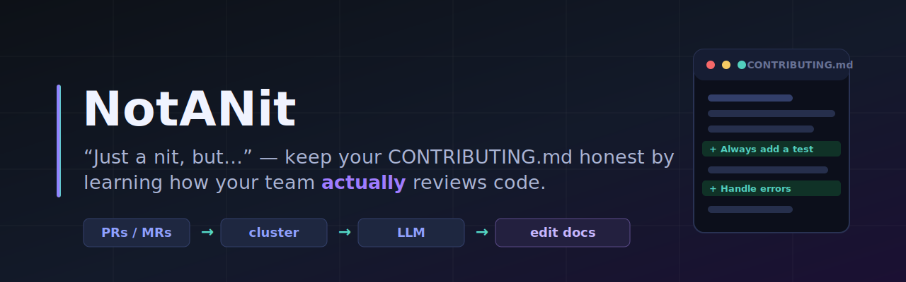
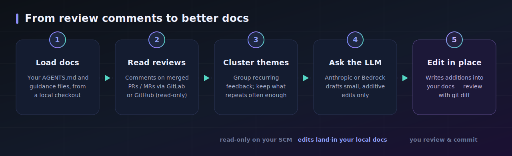

<!-- banner -->
<p align="center">
  
</p>

<h1 align="center">NotANit</h1>

<p align="center">
  <em>&ldquo;Just a nit, but&hellip;&rdquo; — the comments that aren't nits become your standards.<br/>Keep your <code>CONTRIBUTING.md</code> (or any guidance doc) honest by learning from how your team <strong>actually</strong> reviews code.</em>
</p>

<p align="center">
  
  
  
  
  
  
</p>

<p align="center">
  <a href="#what-it-does">What it does</a> ·
  <a href="#-quick-start">Quick start</a> ·
  <a href="#%EF%B8%8F-configuration">Configuration</a> ·
  <a href="#-docker">Docker</a> ·
  <a href="#-providers">Providers</a> ·
  <a href="#-customisation">Customisation</a> ·
  <a href="#-safety">Safety</a>
</p>

---

## What it does

Coding-guidance docs rot. The team agrees on a convention in code review, but the
`AGENTS.md` / `CONTRIBUTING.md` / style guide never catches up — so the same notes
get written by hand on every PR.

**NotANit** closes that loop: it learns from how your team *actually* reviews code
and folds the recurring feedback straight back into your guidance docs, making your codebase more AI-ready.

<p align="center">
  
</p>

It reads your SCM read-only and writes only to the local doc files you name —
never to your SCM host. Review every edit with `git diff` and commit it yourself.

---

## ✨ Highlights

- **Provider-agnostic** — GitLab *and* GitHub out of the box; one factory away from more.
- **Bring your own LLM** — Anthropic Messages API (zero extra deps) or AWS Bedrock (with optional role assumption).
- **One config file tells the story** — a single YAML holds every setting, with `${VAR}` references pulling secret *values* from `.env`. Themes, noise filters, target docs, and even the prompt guidance are all configurable.
- **Works with any doc layout** — `AGENTS.md`, `CONTRIBUTING.md`, `docs/style/*.md`, whatever your team uses.
- **Safe by design** — read-only against your SCM; the LLM is constrained to additive edits you review before committing.

---

## 🚀 Quick start

You need two files — a `config.yaml` (all settings) and a `.env` (the secret
values the config references) — plus a local clone of the repo whose docs you
want to update.

### Run with Docker (recommended — no clone, no Python)

Pulls a prebuilt image from GHCR; nothing to build.

```bash
# 1. Grab the config + secrets templates (no need to clone this project)
curl -fsSL https://raw.githubusercontent.com/<your-org>/notanit/main/config.example.yaml -o config.yaml
curl -fsSL https://raw.githubusercontent.com/<your-org>/notanit/main/.env.example -o .env
#    edit config.yaml  -> set scm.project_path and `pipeline.repo_root: /repo`
#    edit .env         -> fill in the secret values

# 2. Clone the repo you want to analyse
git clone https://github.com/acme/widgets.git /tmp/widgets

# 3. Run — mount config + repo, inject secrets via --env-file
docker run --rm --env-file .env \
  -v "$PWD/config.yaml:/app/config.yaml:ro" \
  -v "/tmp/widgets:/repo" \
  ghcr.io/<your-org>/notanit:latest
```

The doc files under `/tmp/widgets` are edited in place on your host. See [Docker](#-docker)
for the `docker compose` one-liner and how the image is published.

### Run with Python

```bash
git clone https://github.com/<your-org>/notanit.git && cd notanit
pip install -r requirements.txt

git clone https://github.com/acme/widgets.git /tmp/widgets   # the repo to analyse
cp config.example.yaml config.yaml   # set scm.project_path and `repo_root: /tmp/widgets`
cp .env.example .env                 # fill in the secret values

python3 -m scripts.notanit.main      # reads ./config.yaml and ./.env by default
```

All settings live in `config.yaml`; `${VAR}` references pull secret values from `.env`.

### Output

NotANit edits the `target_files` in place — each addition is inserted under the
relevant section heading. A run prints a summary of every change applied.

> **Review before committing.** The edits are written straight to your local doc
> files; inspect them with `git diff` and commit (or discard) yourself.

---

## ⚙️ Configuration

**All configuration lives in one YAML file** ([`config.example.yaml`](./config.example.yaml)) —
it's the single place that tells the whole story of a run. Any value may reference
an environment variable with **`${VAR}`**, resolved at load time. Credentials are
referenced this way, so the config documents what each provider needs while the
secret *values* stay in `.env`:

```yaml
scm:
  provider: github
  project_path: acme/widgets
  token: ${SCM_TOKEN}          # value comes from .env / your shell
```

Resolution precedence (per value):

> **environment variable → YAML config (`${VAR}` resolved) → built-in default**

### Secret values: the `.env` file

`${VAR}` references resolve from your shell environment — and `.env` is just a
convenient, gitignored place to put those values so you don't have to `export`
them by hand:

```bash
cp .env.example .env        # fill in the secret values
python3 -m scripts.notanit.main
```

- `${VAR}` resolves from **`.env` first, then the real shell environment** (shell
  vars already set take precedence over `.env`).
- [`.env.example`](./.env.example) lists every credential, so it doubles as a checklist.
- `.env` is read from the working directory; values already exported in your shell take precedence over it.
- `.env` is a plain `KEY=VALUE` loader (with `#` comment lines and optional quotes) —
  keep comments on their own line, not trailing a value.
- Write a **literal** secret into the YAML (instead of a `${VAR}` reference) and you
  get a **warning** — it's a credential about to be committed.
- If you omit a credential field from the YAML entirely, its conventional env var
  (`SCM_TOKEN`, `ANTHROPIC_API_KEY`, `AWS_*`) is still used as a fallback.

### Settings reference

All settings live in the YAML config — there are no CLI flags. `config.yaml` and
`.env` are read from the working directory. Provider-specific LLM settings live
under `llm.anthropic` / `llm.bedrock`; only the block matching `llm.provider` is
read, so you can keep both populated and switch with one line.

| Setting (YAML key) | Default | Notes |
| --- | --- | --- |
| `scm.provider` | `gitlab` | `gitlab` or `github`. |
| `scm.url` | per provider | API base URL (see [Providers](#-providers)). |
| `scm.project_path` | *(required)* | `group/repo` or `owner/repo`. |
| `scm.token` | — | **Credential** → `${SCM_TOKEN}` (or `GITLAB_TOKEN` / `GITHUB_TOKEN`). |
| `llm.provider` | inferred | Selects the active block. **Optional** — inferred when you configure only one of `llm.anthropic` / `llm.bedrock`; required only if both are populated. |
| `llm.max_tokens` | `4096` | Max output tokens (shared). |
| `llm.anthropic.model_id` | `claude-sonnet-4-6` | Anthropic model ID. |
| `llm.anthropic.api_key` | — | **Credential** → `${ANTHROPIC_API_KEY}`. |
| `llm.anthropic.api_base` | `https://api.anthropic.com` | Override for proxies/gateways. |
| `llm.anthropic.api_version` | `2023-06-01` | Anthropic API version header. |
| `llm.bedrock.model_id` | `us.anthropic.claude-sonnet-4-6` | Bedrock model / inference-profile ID. |
| `llm.bedrock.aws_region` | `us-east-1` | Bedrock region. |
| `llm.bedrock.aws_role_arn` | — | Role assumed before the call (optional). |
| `llm.bedrock.aws_access_key_id` | — | **Credential** → `${AWS_ACCESS_KEY_ID}`. |
| `llm.bedrock.aws_secret_access_key` | — | **Credential** → `${AWS_SECRET_ACCESS_KEY}`. |
| `llm.bedrock.aws_session_token` | — | **Credential** → `${AWS_SESSION_TOKEN}`; only for temporary (`ASIA…`) creds. |
| `llm.bedrock.api_version` | `bedrock-2023-05-31` | Bedrock Anthropic API version. |
| `pipeline.repo_root` | `.` | Local checkout to read & edit docs under (in Docker, the mounted path). |
| `pipeline.target_files` | `[AGENTS.md]` | Repo-relative doc paths to analyse and edit in place. |
| `pipeline.weeks` | `8` | Weeks of merged history to analyse. |
| `pipeline.min_mr_occurrences` | `3` | A theme must appear in at least this many distinct PRs/MRs. |
| `pipeline.max_changes` | `3` | Maximum edits applied per run. |

<sub>The remaining pipeline settings (themes, noise filters, `extra_guidance`, …)
are covered under [Customisation](#-customisation).</sub>

See [`config.example.yaml`](./config.example.yaml) for the full, annotated shape.

### Setting up AWS Bedrock

Bedrock runs the same Anthropic models through your AWS account. Setup:

**1. Install the dependency.** Bedrock needs `boto3` (not pulled in by default):

```bash
pip install boto3        # or: pip install -r requirements.txt
```

**2. Enable model access.** In the AWS console, open **Bedrock → Model access**
and request access to the Anthropic models you intend to use, in the region you
will call. Access is per-account and per-region.

**3. Provide AWS credentials.** Unlike the AWS CLI, NotANit does **not** read the
default credential chain (shared `~/.aws/credentials`, instance profile, etc.) —
you must supply the access key and secret explicitly, or the run fails fast. Put
the **values** in `.env`:

```dotenv
AWS_ACCESS_KEY_ID=AKIA...
AWS_SECRET_ACCESS_KEY=...
# AWS_SESSION_TOKEN=...    # required for temporary/STS creds (ASIA... keys)
```

If you're using **temporary credentials** (an `ASIA…` access key from SSO,
`aws sts`, or an assumed role), you must also set `AWS_SESSION_TOKEN` — they will
not authenticate without it. Long-term IAM keys (`AKIA…`) don't need it.

**4. Reference them, and set the model, in YAML.** The default model is the
cross-region inference profile `us.anthropic.claude-sonnet-4-6` (the `us.` prefix
denotes an inference profile rather than a raw model ID). The region defaults to
`us-east-1`; make sure the model ID's region prefix matches it.

```yaml
llm:
  provider: bedrock
  bedrock:
    model_id: us.anthropic.claude-sonnet-4-6
    aws_region: us-east-1
    aws_access_key_id: ${AWS_ACCESS_KEY_ID}          # value from .env
    aws_secret_access_key: ${AWS_SECRET_ACCESS_KEY}
    aws_session_token: ${AWS_SESSION_TOKEN}          # only for temporary creds
    aws_role_arn: ""          # see step 5
    # api_version: bedrock-2023-05-31   # rarely needs changing
```

**5. (Optional) Assume a role.** If Bedrock access is gated behind an IAM role,
set `llm.bedrock.aws_role_arn` in the YAML. The credentials from `.env` are then
used only to `sts:AssumeRole` into that role (session name `notanit`), and the
temporary credentials make the Bedrock call. Leave it empty to call with the keys
directly.

```yaml
llm:
  bedrock:
    aws_role_arn: arn:aws:iam::123456789012:role/bedrock-invoke
```

Run it (credentials come from `.env`, everything else from the config):

```bash
python3 -m scripts.notanit.main      # reads ./config.yaml and ./.env
```

> The IAM principal (or assumed role) needs `bedrock:InvokeModel` on the target
> model, plus `sts:AssumeRole` on the role when `llm.bedrock.aws_role_arn` is set.

---

## 🐳 Docker

Run NotANit without a local Python setup. The image contains only the code;
your **config**, **secrets**, and the **target repo** are supplied at run time, so
nothing sensitive is ever baked into the image.

```bash
docker run --rm --env-file .env \
  -v "$PWD/config.yaml:/app/config.yaml:ro" \
  -v "/path/to/target-repo:/repo" \
  ghcr.io/<your-org>/notanit:latest
```

The target doc files under `/repo` (the mounted repo) are edited in place, so the
changes appear on your host. `--env-file .env` loads the secret values into the
container environment, where the config's `${VAR}` references resolve them; the
values never touch the image or `config.yaml`. Keep `pipeline.repo_root: /repo` in
your config so the container edits the mounted location.

> **Tags:** `latest` tracks `main`; releases are tagged `v1.2.3` / `1.2`. Pin to a
> version tag for reproducible runs.

### Build it yourself

No need to pull — you can build from a clone instead:

```bash
docker build -t notanit .
docker run --rm --env-file .env \
  -v "$PWD/config.yaml:/app/config.yaml:ro" \
  -v "/path/to/target-repo:/repo" \
  notanit
```

### docker compose

[`docker-compose.yml`](./docker-compose.yml) encodes the mounts so a run is one line:

```bash
TARGET_REPO=/path/to/target-repo docker compose run --rm notanit
```

It reads `.env` for the secrets and mounts `./config.yaml` and `$TARGET_REPO`
(defaulting to `./repo`). Keep `pipeline.repo_root: /repo` in your config so the
container writes to the mounted location.

### Publishing the image

[`.github/workflows/docker-publish.yml`](./.github/workflows/docker-publish.yml)
builds a multi-arch image (`linux/amd64` + `linux/arm64`) and pushes it to GHCR on
every push to `main` and every `v*` tag. It authenticates with the built-in
`GITHUB_TOKEN`, so there are no secrets to configure.

**One-time setup:** the first publish creates a **private** package. Make it public
via the repo's **Packages** page → the package → **Package settings** →
**Change visibility** → *Public*. After that, `docker run ghcr.io/<your-org>/notanit`
works with no login.

---

## 🔌 Providers

### SCM

| Provider | `scm.provider` | Default API base | `scm.project_path` format | Token scope |
| --- | --- | --- | --- | --- |
| GitLab (SaaS or self-hosted) | `gitlab` | `https://gitlab.com` | `group/subgroup/repo` | `read_api` |
| GitHub (.com or Enterprise) | `github` | `https://api.github.com` | `owner/repo` | `repo` read |

- **Self-hosted GitLab:** `scm.url: https://gitlab.example.com`
- **GitHub Enterprise:** `scm.url: https://github.example.com/api/v3`

Adding a provider is a matter of writing a client with a
`fetch_review_comments(weeks)` method that returns `ReviewComment` objects and
registering it in `scm.py:build_scm_client`.

### LLM

| Provider | `llm.provider` | Dependency | Notes |
| --- | --- | --- | --- |
| Anthropic API | `anthropic` | `requests` only | Simplest setup; the default. |
| AWS Bedrock | `bedrock` | `boto3` | Anthropic models on Bedrock, with optional `llm.bedrock.aws_role_arn` role assumption. |

Add one by writing a `_call_<provider>` function in `llm_client.py` and
registering it in the `_PROVIDERS` map.

---

## 🎛 Customisation

Different teams write standards differently — so the analysis is fully tunable
via the config file (no code edits needed):

- **`target_files`** — point at whatever docs your team keeps: `AGENTS.md`,
  `CONTRIBUTING.md`, `docs/engineering/*.md`, multiple files at once.
- **`theme_keywords`** — the lexical buckets. A comment is assigned to the
  **first** theme whose keyword it contains. Replace these to match how *your*
  team reviews.
- **`noise_patterns`** + **`min_comment_length`** — drop more low-signal chatter.
- **`min_mr_occurrences`** / **`max_changes`** / **`weeks`** — sensitivity and volume.
- **`extra_guidance`** — free-text instructions appended to the LLM prompt to
  steer tone or scope (e.g. *"Prefer imperative phrasing; never propose
  formatting rules"*) without touching code.

See [`config.example.yaml`](./config.example.yaml) for the full, annotated shape.

**Getting more signal from a small or quiet repo** — widen the window, lower the
threshold, and read more docs, all in `config.yaml`:

```yaml
pipeline:
  repo_root: /tmp/widgets
  target_files:
    - AGENTS.md
    - CONTRIBUTING.md
  weeks: 26
  min_mr_occurrences: 1
```

> Target files that don't exist in the repo are skipped with a warning — double-check the paths match what's actually committed.

---

## 🔒 Safety

- **Read-only** against your SCM host — NotANit never writes to GitLab/GitHub.
- The LLM is instructed to make **only small additions/clarifications**, never to rewrite or remove existing content.
- Edits are written only to the local doc files you name — nothing is pushed or committed, so you review every change with `git diff` first.

---

## 📦 Requirements

- Python 3.10+ (or just [Docker](#-docker) — no local Python needed)
- `pip install -r requirements.txt` — `requests` + `pyyaml` (required); `boto3` (Bedrock only). `.env` loading is built in, no dependency.
- A YAML config file (copy [`config.example.yaml`](./config.example.yaml) to `config.yaml`)
- A read-only SCM token (GitLab `read_api` or GitHub `repo` read)
- An LLM credential (Anthropic API key **or** AWS Bedrock access)
- A local clone of the target repo (to read the doc files)

---

## 🤝 Contributing

Issues and PRs are welcome — especially new SCM/LLM providers and better theme
clustering. The codebase is small, dependency-light, and provider boundaries are
clean by design. See [`CONTRIBUTING.md`](./CONTRIBUTING.md) for dev setup and how
images are published.

## 📄 License

[MIT](./LICENSE) © 2026 Dennis Callanan
